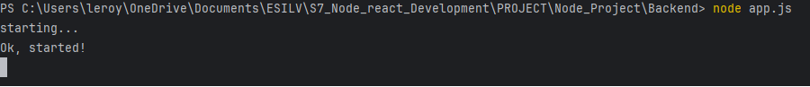
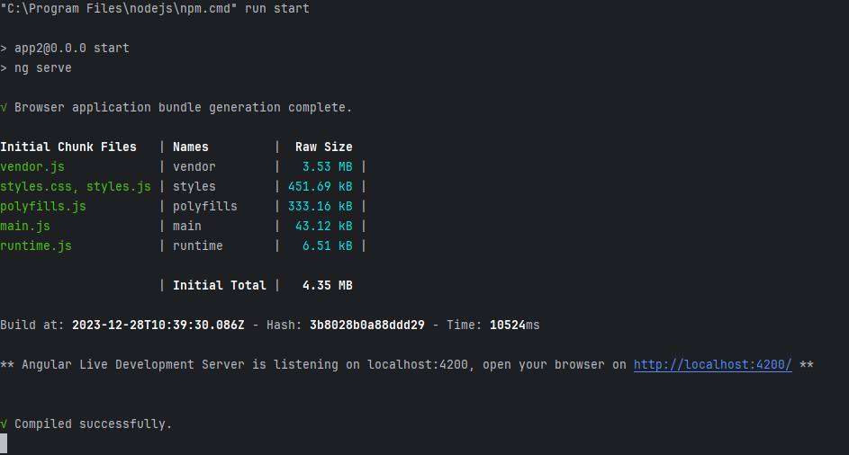

# Building and Launching the Application

This document provides instructions on how to build and launch the application.

## Prerequisites

Ensure that you have the following installed on your system:

- Node.js and npm: You can download and install them from [here](https://nodejs.org/en/download/).
- Angular CLI: Install it globally using npm: `npm install -g @angular/cli`

## Getting the Code

Clone the repository to your local machine using the following command:

`git clone https://github.com/WangAline/Node_Project/`

## Installing the Dependencies

`cd the/directory/where/you/cloned/the/project`  

`npm install`

## Building the Application

You can build the application using the Angular CLI. The build artifacts will be stored in the dist/ directory. 

Run the command :

`ng build`  

## Running the Backend

You can start the backend server using the following command:

`node App.ts`  

The server will start and listen on port 3000. You can access the server at http://localhost:3000/.

## Running the Application

You can run the application using the command:

`ng serve`  

The application will be available at http://localhost:4200/.

Open your web browser and navigate to `http://localhost:4200/`
