# Node_Project
## Flashcards Application

This is a Flashcards application built with Angular. It allows users to create decks of flashcards, add flashcards to a deck, and track their learning progress.
It is based on the existing app Anki.

## Using The Application

Refer to the BUILD.md file present on the github repository root.

## Github Repository

https://github.com/WangAline/Node_Project/

## Credits
Marion De Sousa, Aline Wang, Hubert Leroy

Contact : hubert.leroy@edu.devinci.fr

# Use case of the app

## First Page

We arrive on the first page which by default displayes the first card of the first deck  : 
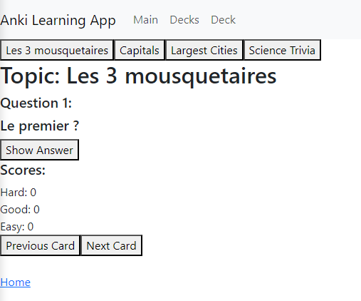

Then we press answer to get the first card question answer  :

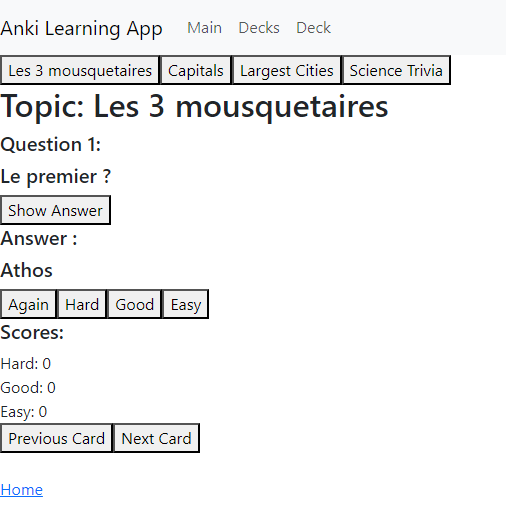

Then we press "hard" because the answer was hard to guess, it automatically switches to the next card question and updates the score adding one to the "hard" score value  :

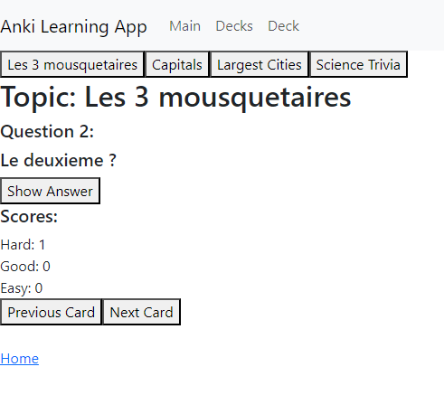

We can then click on the top on the other decks names to switch to them  :

second deck  :  
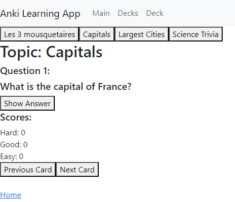

third deck  :  
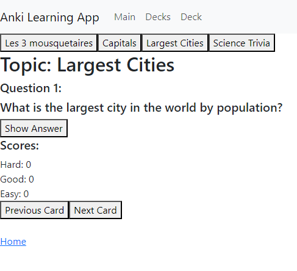

fourth deck  :  
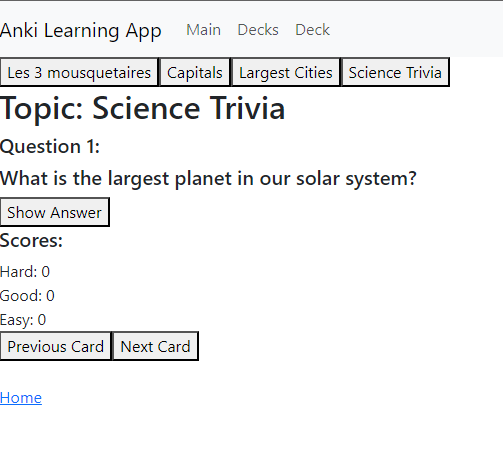

Now that we are one the fourth page we can display the answer,  
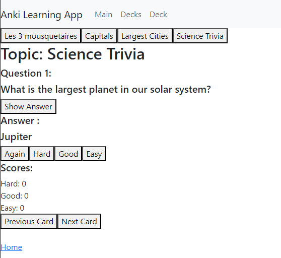

Choose "Good" because it was almost easy tho get for the user  ,  
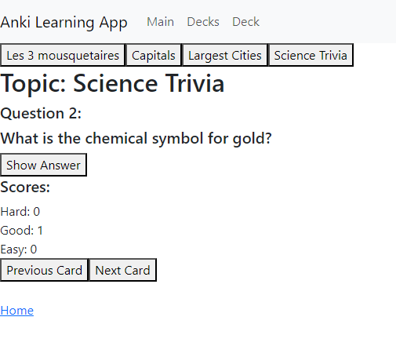

Show the next answer and press "Easy" to get to the third question,  
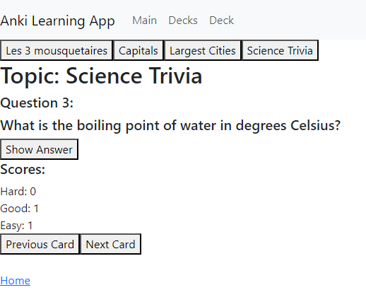

We can see that the score values are updated.  

## Second Page

Our second main step is to go on the second page using the navbar  :  
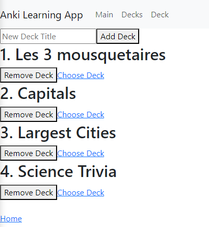

We can see all the decks displayed and manage them.

Our first action can be to remove a deck pressing "Remove deck"  :  
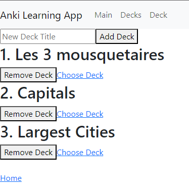

And now add a new deck named "Chicken knowledge"  :  
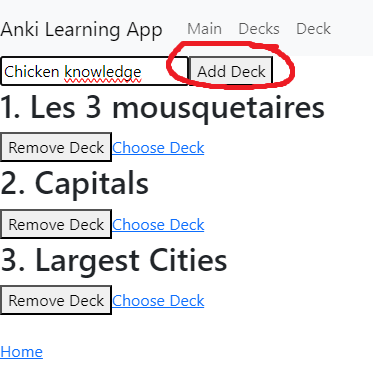
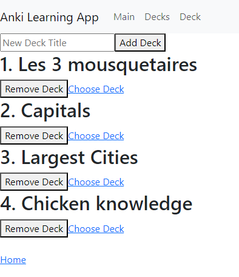

We can choose the deck "Capitals"  :  
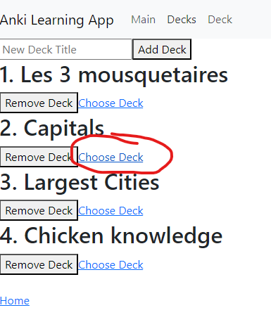
  
And we arrive on the deck page of "Capitals"  :  

We come back to the decks using the navbar and choose "3 mousquetaires"  :  
 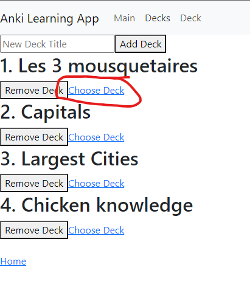

And we arrive on our next part.  
 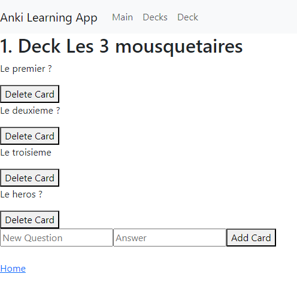

## Third Page

The third page is accessible with the navbar or by choosing the deck in the decks page.  

We will first try to delete a card  :  
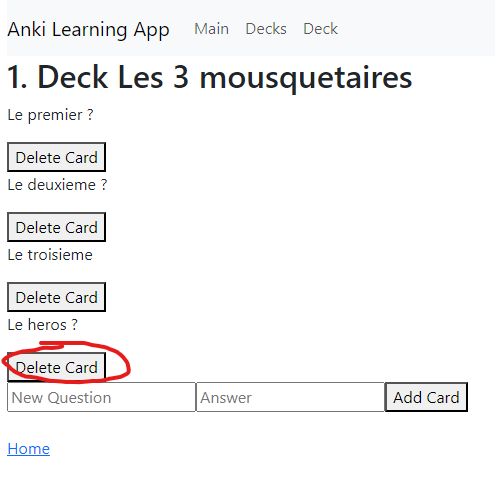

Which is deleted now  :  
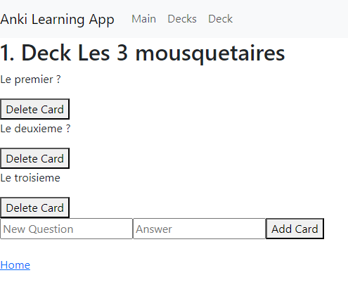

We can now add another card instead  :  
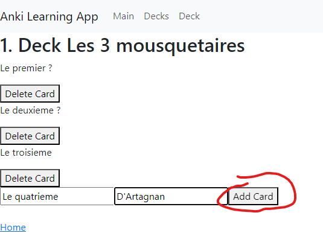

Which appears in the list  :  
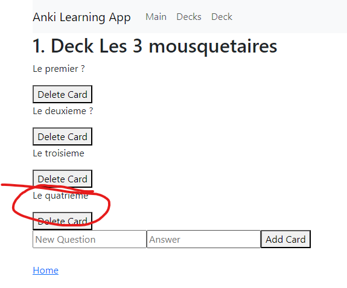

Our next step is to go back to decks page to choose "Chicken knowledge"  :  
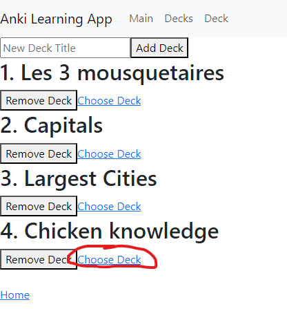

We can see that the added deck is empty  :  
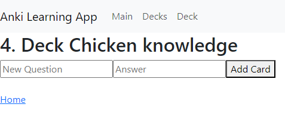

So we can add a card  :  
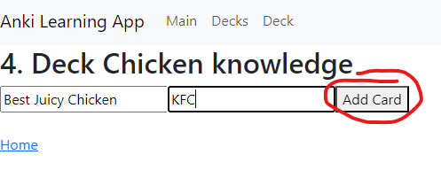 

which appears in the list  :  
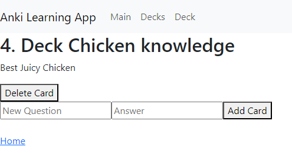

We do the same to add a second card to the deck  :  
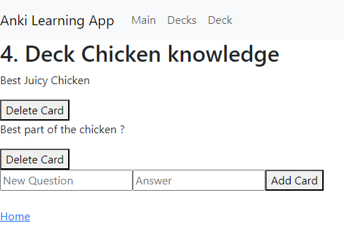

## Testing our added deck

We just added a deck that we need to test  :  
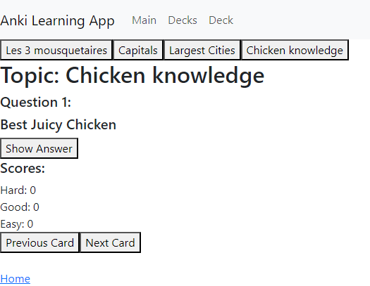

We display its first answer by clicking the button  :  
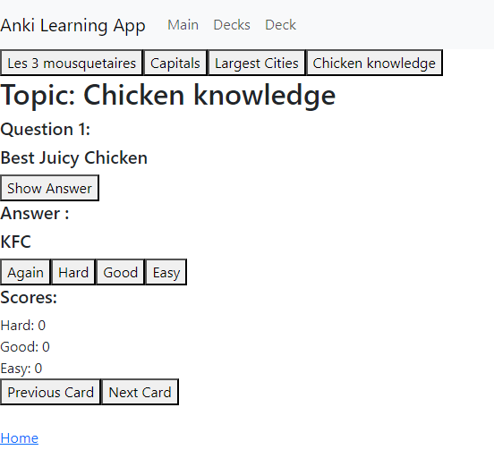

We switch to the second question by clicking one of the three buttons(easy for the first question)  :  
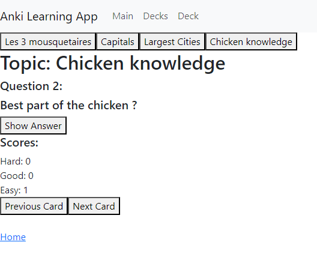

The second question is harder so we click "Hard"  :  
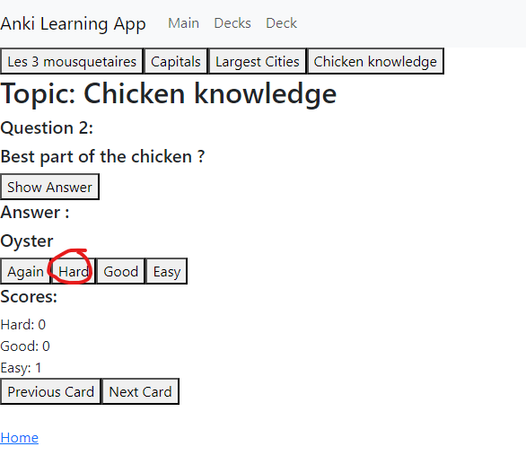

We arrive at the end of the deck  :  
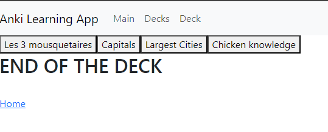

The other decks buttons are still usable so we can switch to another deck to learn  :  
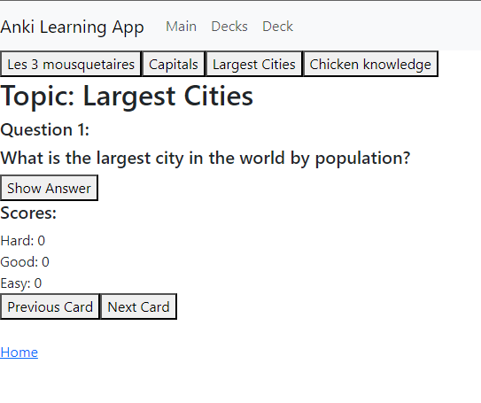

# Thanks For Reading, Happy New Year

