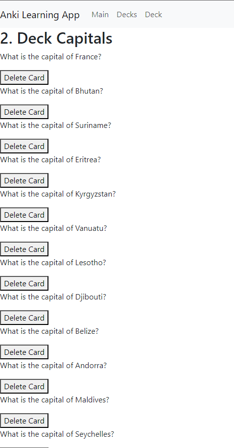

# Node_Project
## Flashcards Application

This is a Flashcards application built with Angular. It allows users to create decks of flashcards, add flashcards to a deck, and track their learning progress.
It is based on the existing app Anki.

## Github Repository

https://github.com/WangAline/Node_Project/

## Credits
Marion De Sousa, Aline Wang, Hubert Leroy

# Use case of the app

## First Page

We arrive on the first page which by default displayes the first card of the first deck  : 

Then we press answer to get the first card question answer  :

Then we press "hard" because the answer was hard to guess, it automatically switches to the next card question and updates the score adding one to the "hard" score value  :

We can then click on the top on the other decks names to switch to them  :

second deck  : 

third deck  : 

fourth deck  : 

Now that we are one the fourth page we can display the answer,  

Choose "Good" because it was almost easy tho get for the user,  

Show the next answer and press "Easy" to get to the third question,

We can see that the score values are updated.  

## Second Page

Our second main step is to go on the second page using the navbar  : 

We can see all the decks displayed and manage them.

Our first action can be to remove a deck pressing "Remove deck"  : 

And now add a new deck named "Chicken knowledge"  :

We can choose the deck "Capitals"  :

And we arrive on the deck page of "Capitals"  :

We come back to the decks using the navbar and choose "3 mousquetaires"  :
 
 And we arrive on our next part.  
 

## Third Page

The third page is accessible with the navbar or by choosing the deck in the decks page.  

We will first try to delete a card  :

Which is deleted now  :

